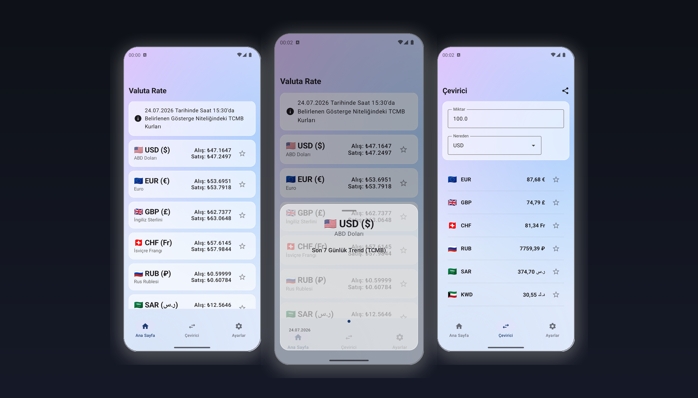

# Valuta Rate 💱


<p align="center">
  
</p>

Valuta Rate is a modern, premium, and highly dynamic currency converter application built natively for Android. Designed with a stunning **Glassmorphism** UI and fluid animations, Valuta Rate offers a seamless experience for tracking and converting currencies using the official indicative exchange rates provided by the **TCMB (Central Bank of the Republic of Turkey)**.

## ✨ Features

- 🏛️ **TCMB Official Integration:** Fetches daily official cross rates directly from the Central Bank of the Republic of Turkey.
- 💎 **Glassmorphism UI:** A premium, translucent, and deeply aesthetic user interface with custom mesh backgrounds.
- 📈 **7-Day Trend Charts:** Interactive line charts to track historical rate fluctuations over the past 7 days.
- 🌐 **Localization (i18n):** Full out-of-the-box support for 4 languages: English, Turkish, German, and French.
- 🔄 **Responsive Converter:** Instantly convert between different currencies with an intuitive calculation engine.
- ⚡ **Offline Support:** Caches the latest rates locally using Room DB so you can check conversions anytime without network latency.
- ⭐ **Favorites Management:** Star your most-used currency pairs to pin them at the top of your list.

## 🛠 Tech Stack & Architecture

Valuta Rate is engineered using modern Android development best practices:

- **Language:** 100% Kotlin
- **UI:** Jetpack Compose (Material 3) with Custom Glassmorphism Theme
- **Architecture:** Clean Architecture + MVVM (Model-View-ViewModel)
- **Dependency Injection:** Dagger Hilt
- **Networking:** Retrofit 2 + OkHttp 4
- **Database & Caching:** Room Database
- **Preferences:** DataStore Preferences
- **Concurrency:** Kotlin Coroutines & StateFlow

## 🚀 Getting Started

To run this project locally, clone the repository and open it in Android Studio.

### Prerequisites
- Android Studio Ladybug (or newer)
- JDK 17
- Android SDK 36

### Security Configuration
For security reasons, signing credentials and private API/AdMob keys are not committed to this repository. To compile the project locally, create a `local.properties` file in the root directory and add the following default configuration:

```properties
ADMOB_APP_ID=ca-app-pub-3940256099942544~3347511713
ADMOB_BANNER_AD_UNIT_ID=ca-app-pub-3940256099942544/6300978111
ADMOB_INTERSTITIAL_AD_UNIT_ID=ca-app-pub-3940256099942544/1033173712
```

## 🤝 Contribution
Feedback, bug reports, and pull requests are always welcome! Feel free to open an issue if you encounter any problems or have feature requests.

## 👨‍💻 Developer
Developed with ❤️ by **gokcank**.
